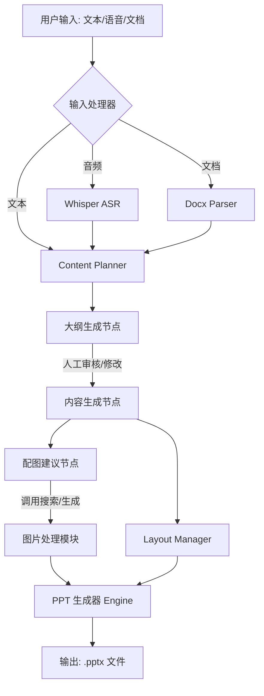

# 技术方案设计 - ChatPPT

## 1. 架构设计

本系统采用 **AI Agent 工作流架构**，旨在将非结构化的用户输入转化为结构化的演示文稿。系统将逐步从当前的“线性 Pipeline”向“基于 LangGraph 的有向无环图 (DAG)”演进，以支持状态管理和人工干预。

### 1.1 核心架构图 (Mermaid)

## 2. 技术栈选型

*   **核心框架**: Python 3.10+, LangChain, LangGraph (建议引入)
*   **交互界面**: Gradio
*   **文档处理**: `python-pptx` (PPT 生成), `python-docx` (Word 解析)
*   **图像处理**: `Pillow` (PIL)
*   **大模型调度**: 阿里云百炼 (DashScope) / LangChain ChatTongyi
*   **多模型策略**: 针对不同复杂度的节点使用不同规格的模型 (如 qwen-max, qwen-plus) 以平衡性能与成本。

## 3. 外部依赖能力清单

系统实现核心功能需要依赖以下外部服务及模型能力：

### 3.1 LLM 认知能力 (核心驱动)
*   **服务商**: 阿里云 (DashScope)
*   **模型分配**: 
    *   **大纲生成 (Planner)**: 使用 `qwen-max` 以获得最佳的逻辑规划能力。
    *   **内容创作 (Generator)**: 使用 `qwen-plus` 进行高效的文案扩写。
    *   **配图建议 (Image Advisor)**: 使用 `qwen-turbo` 处理简单的关键词提取任务。
*   **用途**: 
    *   **意图理解**: 将用户模糊的需求转化为 PPT 大纲。
    *   **内容创作**: 扩写 Bullet Points，优化幻灯片文案。
    *   **结构化输出**: 将 Markdown/文本 转换为系统可解析的 JSON/DataClass。
    *   **配图建议**: 根据文本语义生成图像搜索关键词（Query）。

### 3.2 多模态感知能力 (输入端)
*   **语音识别 (ASR)**: 阿里云录音文件识别或 OpenAI Whisper API。
*   **文档解析**: 能够理解 Docx 结构的解析器。
*   **视觉理解 (VLM)**: Qwen-VL 或 GPT-4o-vision（用于分析用户上传的图片素材）。

### 3.3 图像获取能力 (配图端)
*   **搜索引擎 API**: Bing Image Search API (或类似 `requests`+`BeautifulSoup` 的爬虫方案)。
*   **图像生成 (可选)**: 通义万相 (Wanx) 或 DALL-E 3。

### 3.4 基础运行环境
*   **对象存储**: 用于临时存储上传的音频、文档及生成的 PPT（本地存储或 OSS）。

## 4. 关键模块设计

| 模块名称 | 职责描述 | 实现逻辑参考 |
| :--- | :--- | :--- |
| **Input Node** | 多模态输入归一化 | `openai_whisper.py`, `docx_parser.py` |
| **State Manager** | 维护 PPT 全局状态 (大纲、内容、图片) | `data_structures.py`, LangGraph State |
| **Image Advisor** | 自动化配图与关键词优化 | `image_advisor.py` |
| **Layout Manager** | 幻灯片占位符与版式自动匹配 | `layout_manager.py`, `template_manager.py` |
| **PPT Generator** | 最终 .pptx 文件的渲染与导出 | `ppt_generator.py`, `slide_builder.py` |

## 5. 安全性与性能优化

*   **API Key 管理**: 集中在 `.env` 或 `config.json` 中，不硬编码。
*   **超时控制**: 在语音转录和图片下载环节设置 `timeout` 和重试机制。
*   **并发处理**: 利用 LangGraph 的并行节点同时处理配图与内容润色，减少生成耗时。
